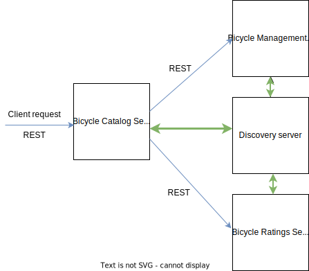

# Project Overview

Bicycle-catalog is a simple microservice built with Spring Boot and Maven. This serves an API which depends 
on 2 other microservices - bicycle-management and bicycle-ratings. If any of these 2 dependent
microservices fail to respond then a circuit breaker is implemented which will serve data
through a fallback method.  

Service Discovery is achieved using Eureka server and the microservices are Eureka clients
which register with the server.




## API details

Sample URL to call the api:  
localhost:8082/catalog/{userid}  
where userid can be any string

Sample response:  
```[  
{  
"name": "Emonda SLR6",  
"vendor": "Trek",  
"rating": 4  
},  
{  
"name": "Infinito XE 11SP",  
"vendor": "Bianchi",  
"rating": 3  
}  
]  
```
In above sample response, the rating value comes from the bicycle-ratings service
while the bicycle info like name and vendor come from the bicycle-management service.

## Technology stack

Spring Boot  
Eureka  
Resilience4J  
Actuator